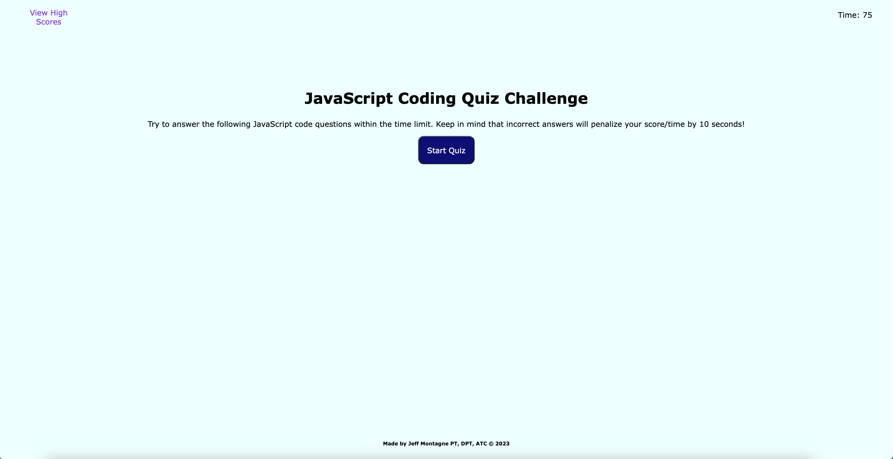

# Code-Quiz-4

## Description

The purpose of this application is to test students on their knowledge of JavaScript. In a multiple choice format, student will be presented with a question and select the correct answer. If selected incorrectly, time will be deducted from the running quiz time resulting in a lower overall score on the quiz. Students will be able to save their scores in order to try and beat the top score. The application combines basic JavaScript with HTML and CSS code to create an interactive, functional application. 

User Story
AS A coding boot camp student
I WANT to take a timed quiz on JavaScript fundamentals that stores high scores
SO THAT I can gauge my progress compared to my peers

Acceptance Criteria
GIVEN I am taking a code quiz
WHEN I click the start button
THEN a timer starts and I am presented with a question
WHEN I answer a question
THEN I am presented with another question
WHEN I answer a question incorrectly
THEN time is subtracted from the clock
WHEN all questions are answered or the timer reaches 0
THEN the game is over
WHEN the game is over
THEN I can save my initials and score

## Installation

N/A

## Usage

Website: https://tagne13.github.io/Code-Quiz-4/

Repository: https://github.com/Tagne13/Code-Quiz-4.git 

## Credits

- Credit to class TA Will and mentor Geraldo for assistance with debugging and help with the timer function. 
- https://www.youtube.com/watch?v=AFTvxsVv52k&t=595s: guidance with HTML.
- https://www.interviewbit.com/javascript-mcq/: additional question used.
- Other questions taken from example in class module.

## License 

Please refer to the license in the repo.

[def]: ./assets/images/Screenshot.png